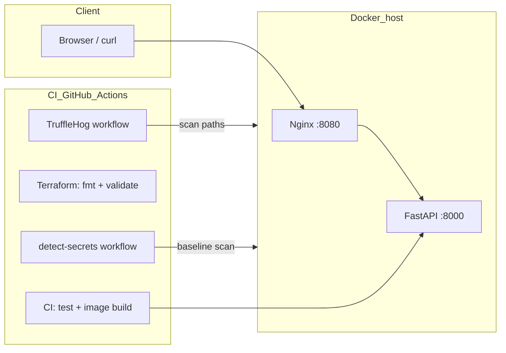

<div align="center">

# TruffleHog Secret Scan Lab

**End-to-end reference for shipping a small API with Docker, Nginx, Terraform, and split CI/CD pipelines that treat secret scanning as a first-class gate.**

[](https://fastapi.tiangolo.com/)
[](https://registry.terraform.io/providers/kreuzwerker/docker/latest/docs)
[](https://github.com/features/actions)
[](https://github.com/trufflesecurity/trufflehog)
[](https://github.com/Yelp/detect-secrets)

</div>

---

## Table of contents

- [Why this project exists](#why-this-project-exists)
- [What was implemented](#what-was-implemented)
- [Architecture at a glance](#architecture-at-a-glance)
- [Repository layout](#repository-layout)
- [Prerequisites](#prerequisites)
- [Run locally](#run-locally)
- [CI/CD pipelines](#cicd-pipelines)
- [Secret scanning behavior](#secret-scanning-behavior)
- [Maintaining the detect-secrets baseline](#maintaining-the-detect-secrets-baseline)
- [Security and ethics](#security-and-ethics)

---

## Why this project exists

Modern teams leak credentials through **config files, env snippets, and copy-pasted examples** long before production. Regulators and security programs expect **automated secret detection** in CI—not a one-off manual audit.

This repository is a **deliberately small but complete vertical slice** that shows how to:

1. Run a real HTTP service (**FastAPI**) behind **Nginx** in **Docker**.
2. Describe the same stack with **Terraform** using the **Docker provider** (no cloud bill required—only a local Docker engine).
3. Wire **GitHub Actions** so **build, test, IaC validation, and secret scanning** are separate, observable stages.
4. Compare **two popular scanners**—**TruffleHog** (verification-oriented, rich detectors) and **Yelp detect-secrets** (baseline-driven static scan)—in **isolated workflows**, which mirrors how teams often adopt tools incrementally or satisfy different policy owners.

It is suitable as a **template**, **training repo**, or **proof of concept** for “secure SDLC” discussions.

---

## What was implemented

### Application layer

| Item | Description |
|------|-------------|
| **FastAPI service** | `app/main.py` exposes `/` and `/health` for liveness checks and simple smoke testing. |
| **Container image** | `app/Dockerfile` builds a slim Python 3.12 image, installs dependencies, and runs **Uvicorn** on port `8000`. |
| **Automated tests** | `app/tests/test_main.py` uses **pytest** and **httpx** `TestClient` for fast unit-level API checks—no live server required. |
| **Dependency splits** | `app/requirements.txt` for runtime; `app/requirements-dev.txt` pulls runtime + **pytest** + **httpx** for CI and local dev. |

### Edge and orchestration

| Item | Description |
|------|-------------|
| **Nginx reverse proxy** | `nginx/default.conf` terminates HTTP on port 80 inside the proxy container and forwards to the app upstream (`app:8000` in Compose; Terraform assigns the **network alias `app`** so the same config works). |
| **Docker Compose** | `docker-compose.yml` defines **app** (build + healthcheck) and **nginx** (published **8080→80**), with `depends_on` tied to app health. |
| **Terraform on Docker** | Under `terraform/`: `versions.tf` pins the **kreuzwerker/docker** provider; `main.tf` builds the app image, creates a user-defined network, runs the app container with a healthcheck, and runs Nginx with the config volume-mounted. `variables.tf` / `outputs.tf` expose naming and the public URL hint. |

### CI/CD (GitHub Actions)

All workflows live under `.github/workflows/` and use **least-privilege** `contents: read` where applicable.

| Workflow file | What it does |
|---------------|----------------|
| **`ci.yml`** | **Continuous integration**: checkout → Python 3.12 + pip cache → install `requirements-dev.txt` → **`pytest`** → **Docker Buildx** build of the app image (cache backed by **GitHub Actions cache**), **no registry push** (fits free-tier and lab use). |
| **`terraform.yml`** | **IaC gate** (runs when `terraform/**` changes): **HashiCorp setup-terraform** → **`terraform fmt -check`** → **`terraform init -backend=false`** → **`terraform validate`**. Keeps modules syntactically correct without needing cloud credentials. |
| **`trufflehog.yml`** | **Dedicated secret scan #1**: runs the official **TruffleHog** container against the workspace. Default runs **scope-limited** filesystem paths so routine pushes stay green; **manual dispatch** can scan the **entire repo** including demo fixtures. |
| **`detect-secrets.yml`** | **Dedicated secret scan #2**: installs **Yelp detect-secrets** (pinned **1.5.0**) and runs **`detect-secrets scan`** against **`.secrets.baseline`**, with excludes for the baseline file and pytest cache—typical **baseline workflow** used in many Python codebases. |

Together, this implements a **split pipeline** pattern: build/test and IaC validation do not run inside the same job graph as TruffleHog or detect-secrets, so failures are **easier to attribute** and **permissions can evolve independently** (for example, stricter rules on secret scanners later).

### Deliberate “bad” fixtures (for scanner demos)

| Path | Role |
|------|------|
| **`samples/unsafe-fixtures/demo_database.yaml`** | Synthetic YAML resembling **database credentials**, **AWS-style keys** (including documented example-style material), **GitHub PAT-shaped** strings, **email/password** fields, **Stripe test key**, **Slack webhook** URL. |
| **`samples/unsafe-fixtures/legacy_config.py`** | Same idea in Python constants: AWS-shaped keys, **GitLab**/**Azure DevOps**-style tokens, DB user/password, contact emails. |
| **`.secrets.baseline`** | Serialized **detect-secrets** state for those fixtures so CI can enforce **“no new secrets beyond baseline”** on Linux (paths normalized to forward slashes). |

> These files exist **only** to exercise scanners and training scenarios. They must **never** hold real secrets.

---

## Architecture at a glance



**Runtime data path:** outside traffic hits **Nginx** on the host-mapped port; Nginx proxies to the **app** container. **Terraform** and **Compose** are two ways to create that same logical topology on a single machine.

---

## Repository layout

```text
.
├── app/
│   ├── Dockerfile
│   ├── main.py
│   ├── requirements.txt
│   ├── requirements-dev.txt
│   └── tests/
│       └── test_main.py
├── nginx/
│   └── default.conf
├── terraform/
│   ├── main.tf
│   ├── outputs.tf
│   ├── variables.tf
│   └── versions.tf
├── samples/
│   └── unsafe-fixtures/          # synthetic “leaks” for demos only
├── .github/
│   └── workflows/
│       ├── ci.yml
│       ├── terraform.yml
│       ├── trufflehog.yml
│       └── detect-secrets.yml
├── .secrets.baseline             # Yelp detect-secrets baseline
├── docker-compose.yml
└── README.md
```

---

## Prerequisites

- **Docker Desktop** (or any Docker Engine) for Compose and for Terraform’s Docker provider.
- **Python 3.12+** if you run tests or regenerate the baseline locally.
- **Terraform ≥ 1.5** on your PATH if you run `terraform` locally (CI installs its own).
- A **GitHub** remote if you want Actions to execute (public repos fit common free-tier CI usage).

---

## Run locally

### Option A — Docker Compose (fastest)

```powershell
docker compose up --build
```

Then open: `http://localhost:8080/health`

### Option B — Terraform (same stack, declarative)

```bash
cd terraform
terraform init
terraform apply
```

Default **Nginx** host port is **8080** (see `terraform/variables.tf` and outputs).

---

## CI/CD pipelines

| Trigger (typical) | Workflows involved |
|-------------------|--------------------|
| Push / PR to `main` (app code) | **`ci.yml`** |
| Push / PR touching `terraform/**` | **`terraform.yml`** (path-filtered) |
| Push / PR (secret posture) | **`trufflehog.yml`**, **`detect-secrets.yml`** |

**Design choice:** TruffleHog and detect-secrets are **not** folded into `ci.yml` so you can:

- rerun or tune scanners without rebuilding images,
- assign different failure policies per tool,
- mirror how organizations onboard **AppSec-owned** workflows separately from **platform** build jobs.

---

## Secret scanning behavior

### TruffleHog (`trufflehog.yml`)

- **Push / pull_request:** scans a **curated set of paths** (`app/`, `nginx/`, `terraform/`, `.github/`, `docker-compose.yml`, `README.md`) so the default branch is not permanently red because of intentional demo fixtures.
- **workflow_dispatch** with **`include_demo_fixtures: true`:** scans **`.`** (entire repo), including **`samples/unsafe-fixtures/`**. Expect **findings and a failed job** if TruffleHog treats synthetic material as credentials—useful for demos and tabletop exercises.

### Yelp detect-secrets (`detect-secrets.yml`)

- Runs **`detect-secrets scan --baseline .secrets.baseline`** with **`--all-files`** and excludes for **`.secrets.baseline`** and **`.pytest_cache`**.
- **New** secret-shaped content not reflected in the baseline will **fail** the workflow—this is the standard **shift-left** contract for baseline-based scanning.

---

## Maintaining the detect-secrets baseline

When you intentionally change demo fixtures or add new allowlisted entries, regenerate the baseline (same version as CI for reproducibility):

```bash
pip install "detect-secrets==1.5.0"
detect-secrets scan --all-files \
  --exclude-files '\.secrets\.baseline' \
  --exclude-files '\.pytest_cache' \
  --force-use-all-plugins > .secrets.baseline
```

If your policy requires human review of each finding:

```bash
detect-secrets audit .secrets.baseline
```

Commit the updated `.secrets.baseline` on a branch and merge through your normal review process.

---

## Security and ethics

- **Never** replace synthetic values in `samples/unsafe-fixtures/` with real API keys, passwords, or tokens.
- This repo is a **lab**: production systems should combine secret scanning with **pre-commit hooks**, **private scanning** for monorepos, **vaults/KMS**, and **short-lived credentials**—this project illustrates **one slice** of that story (CI detection + dual tools), not the whole security program.

---

<div align="center">

**Built as a practical reference for Docker + Nginx + Terraform + GitHub Actions + TruffleHog + detect-secrets.**

</div>
